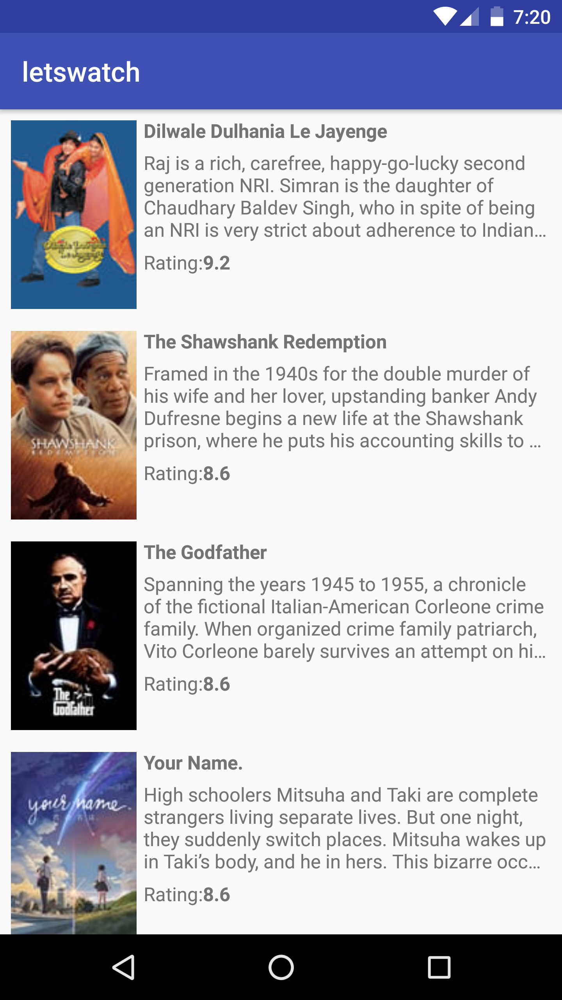

# letswatch

This repository uses https://www.themoviedb.org/documentation/api to display movie information.

It demonstrate the use of kotlin, kotlin coroutine, dagger2, mvvm, use case, livedata, and repository pattern. 

It uses robolectric, mockito, and espresso for testing.

Work on this application is still in early days and will be continued to showcase different architectural patterns, android apis, libraries, and test strategies. Some code and ideas are taken from [google architecture samples](https://github.com/googlesamples/android-architecture-components).

